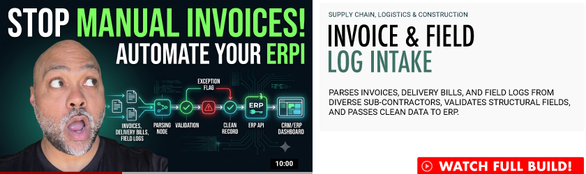

<a href="https://youtu.be/WPITVPNaPB0?si=4X_1kFoWvDbHoT4t" target="_blank">
  
</a>  

# Invoice & Field Log Intake  
### Supply Chain, Logistics & Construction   
Parses invoices, delivery bills, and field logs from diverse sub-contractors, validates structural fields, and passes clean data to ERP.  

**Status:** `● ARCHITECTURE PREVIEW` (reference shell) · **Live reference:** TODO: add URL if a reference deployment is stood up

The shared demo shell every IAS build deploys from. One config file per build drives the entire page — hero, honest status chip, architecture map, sample payload, and CTA. Clone it, fill `build.config.ts`, deploy to Vercel. Done.

**Stack:** Next.js 14 (App Router, static export) · TypeScript · plain CSS on the IAS design token system · Vercel

---

## Why this exists

Nineteen portfolio builds share one page anatomy. Building that page once — and enforcing brand tokens, honest build status, and the fabrication prohibition structurally — means every new build is a config file and a diagram, not a frontend project.

Two governance rules are built into the code, not the process:

1. **Honest status.** Every page renders a status chip: `LIVE DEMO`, `INTERACTIVE PROTOTYPE`, or `ARCHITECTURE PREVIEW — BUILD IN PROGRESS`. The emerald treatment is reserved for genuinely live demos. The demo section renders **only** when a real demo URL exists.
2. **TODOs cannot ship silently.** Any config string still starting with `TODO:` renders on the page in a visible flag style. Unfinished content announces itself.

## Using this template

1. On GitHub: **Use this template** → name the new repo `ias-build-NNN-slug`.
2. Edit `build.config.ts` — it is the only file you touch:
   - identity (`buildNumber`, `name`, `sector`, `tagline` — pull the tagline verbatim from `projects.csv`)
   - `status` (be honest; upgrade it as the build matures)
   - `whatItDoes`, `stack`
   - `architecture` (layers table + numbered data flow; add a diagram to `/public/diagrams` when one exists)
   - `payload` (production schema, mock values, labeled as mock)
   - `links` (repo URL, portfolio, booking page)
3. Drop the n8n export into `/workflows` when the workflow exists.
4. Import the repo into Vercel → add the custom domain `{slug}.elwoodberry.com` → done. Pushes to `main` auto-deploy.

## Local development

```bash
npm install
npm run dev      # http://localhost:3000
npm run build    # static export to /out
```

## Structure

```
build.config.ts        ← the one file that changes per build
lib/types.ts           ← config shape + status map (template-owned)
app/                   ← layout, page, global styles (template-owned)
components/            ← Hero, StatusChip, Architecture, SamplePayload, DemoSlot, FooterCta
public/diagrams/       ← real architecture diagrams only
workflows/             ← n8n exports (credentials stripped)
docs/ADDING_A_BUILD.md ← step-by-step checklist
```

Template-owned files should not be edited per build — improvements to them belong here, in the template, so all builds inherit them on the next sync.

## Design tokens

Tokens are inlined in `app/globals.css` from `ias_color_system.csv`. The Core 5 base colors are locked; tint/shade stops are **v0.9 pending formal approval**. When `@ias/tokens` ships as a package, `globals.css` swaps its `:root` block for the package import — no component changes.

## License

Portfolio-demonstrative code. All rights reserved — see `LICENSE.md`. Public demos show capability; licensed client software lives in private repositories.
